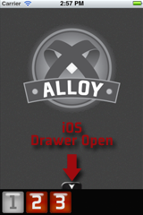

# Drawer Widget Sample

The Drawer widget provides a sliding panel of buttons to pull up from the bottom of the screen. As an option, the drawer can automatically close after it has been used. On Android, the drawer manifests itself as the activity menu, unless the developer wants to specifically override that capability.

This example shows a basic window with three buttons in the drawer. The first button is disabled and the rest are enabled.

1. To use this sample, launch Studio and create a new Titanium Alloy Project. File -> New -> Titanium Alloy Project. Ensure that iPhone, iPad, Android, and Mobile Web deployment targets are checked. Uncheck the *automatically cloud-enable this project* check box.
2. Copy the contents of the widget_drawer folder to your project folder/app directory.
3. Build and run your project!

Alternatively, if you have downloaded the alloy project from github you can:

1. Open a terminal window
1. `cd <alloydir>`
1. `sudo jake app:run dir=widgets/widget_drawer platform=<platform> tiversion=<version>` 

Where `<platform>` is one of iphone, ipad, mobileweb, android and `<version>` is the version of the SDK you want to use (e.g. 2.1.3.GA).

The drawer widget is defined in a separate 'widgets' subdirectory. See the documentation for [com.appcelerator.drawer](https://github.com/appcelerator/alloy/blob/master/widgets/com.appcelerator.drawer/docs/README.md) for more information.

