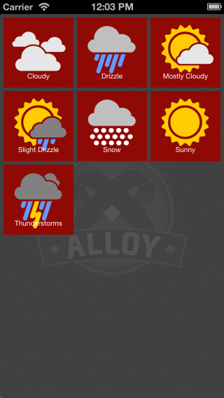
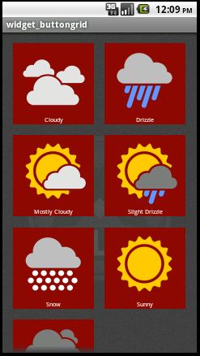
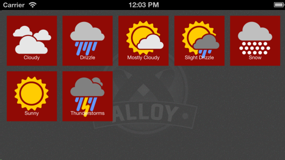

# ButtonGrid Widget
## Overview

The **ButtonGrid** widget provides a cross-platform grid of buttons that automatically lay themselves out in the view similar to the iOS native Dashboard control. 





## Manifest
* Version: 1.0 (stable)
* Github: https://www.github.com/appcelerator/alloy
* License: [Apache 2.0](http://www.apache.org/licenses/LICENSE-2.0.html)
* Author: Carl Orthlieb
* Supported Platforms: iOS, Android, Mobile Web

## Adding the ButtonGrid Widget to Your Alloy Project

* In your application's config.json file you will want to include the following line in your dependencies:

```
"dependencies": {
    "com.appcelerator.buttongrid":"1.0"
}
```
### Creating a Local Copy
Normally, ButtonGrid can be accessed without copying because it is part of Alloy, just adding it as a dependency to your project is enough. However, if you want to create a copy local to your application so that you can further modify it, then you will need to:

1.  Create a widgets directory in your app directory if it doesn't already exist.
2.  Copy the com.appcelerator.buttongrid folder from the alloy/widgets directory into your app/widgets directory. 

## Create a ButtonGrid in the View

You can add a ButtonGrid to a view by *requiring* the ButtonGrid widget. 

	<Widget id="buttongrid" src="com.appcelerator.buttongrid"/>

Assign it an ID that you can use in your controller. E.g. `id="buttongrid"` You can now access the ButtonGrid via `$.buttongrid` in your controller. 

## [Initializing the ButtonGrid in the Controller](id:init)

The buttongrid doesn't have any buttons in it until you initialize it in your controller. Before you open your window, you will want to call the buttongrid with the *init* method. For example:

```
$.buttongrid.init({
    buttons: [
        { id: 'Cloudy', title: "Cloudy", backgroundColor: gray, backgroundSelectedColor: lightgray },
        { id: 'Drizzle', title: "Drizzle" },
        { id: 'Haze', title: 'Haze' },
        { id: 'MostlyCloudy', title: "Mostly Cloudy" },
        { id: 'SlightDrizzle' },
        { id: 'Snow', title: 'Snow' },
        { id: 'Sunny', title: 'Sunny' },
        { id: 'Thunderstorms', title: 'Thunderstorms', click: function (e) { alert("Thunder!"); } }
    ],
    buttonWidth: Alloy.isTablet ? 200: 100,
    buttonHeight: Alloy.isTablet ? 200 : 100,
    backgroundColor: red,
    backgroundSelectedColor: brightred
});
```

### Initialization Parameters

| Parameter | Type | Description |
| --------- | ---- | ----------- |
| buttons | *array* | The buttons array is an array of button objects each of which  describes a button to create in the grid. |
| buttonWidth | *integer* | Width of a button in pixels. |
| buttonHeight | *integer* | Height of a button in pixels. |
| backgroundColor | *string* | [Optional] RGB triplet or named color to use as the background for the button. This can be overridden by button definition itself (see the button Object for more details) Default: *transparent* | 
| backgroundSelectedColor | *string* |  RGB triplet or named color to use as the background for the button when it is selected. This can be overridden by button definition itself (see the button Object for more details) Default: *transparent* |
| duration | *integer* | [Optional] Duration, in milliseconds, for the grid to animate when relaying out on orientation change. Default: *2000* |
| fontSize | *integer* or *string* | [Optional] Size of the text label in the button. Default: *10dp* |
| textColor | *string* | [Optional] RGB triplet or named color to use for the text label on the button. Default: *white* |
| textSelectedColor | *string* | [Optional] RGB triplet or named color to use for the text label on the button when it is selected. Default: *black* |    

#### button Object
| Parameter | Type | Description |
| --------- | ---- | ----------- |
| id | *string* | Unique id for this item. This id also selects the image icons for this button. The ButtonGrid expects to find the image at app/assets/images/\<id\>.png. |
| title | *string* | [Optional] The text that describes this button that will appear underneath the icon. |
| click | *function* | [Optional] The callback to call when the button is clicked. The function has an event parameter similar to that used for regular buttons. If you don't specify a click callback then the button does nothing. |
| backgroundColor | *string* | [Optional] RGB triplet or named color to use as the background for the button. This overrides any ButtonGrid level backgroundColor. Default: *transparent* | 
| backgroundSelectedColor | *string* | [Optional] RGB triplet or named color to use as the background for the button when it is selected. This overrides any ButtonGrid level backgroundColor. Default: *transparent* |            

## Binding
Because you are passing in functions to be called when a button is clicked, be aware of your binding. The *this* object is not the same when the `click()` and `enable()` callbacks are called as when they are defined. There are many excellent articles that talk about this issue:

* [Getting Out of Binding Situations in JavaScript](http://www.alistapart.com/articles/getoutbindingsituations/)
* [Javascript, "bind", and "this"](http://fitzgeraldnick.com/weblog/26/)
* [Binding Scope in JavaScript](http://www.robertsosinski.com/2009/04/28/binding-scope-in-javascript/)

It's recommended that you use the underscore library's [bind](http://underscorejs.org/#bind) function to bind your callbacks when needed.

```
$.buttongrid.init({
	buttons: [
    	{ id: 'Fancy', text: 'Fancy', click: 
    		_.bind(function FancyClick(e) { alert(this.one); }, this) 
    	}
    ]
});
```
## Relaying out the ButtonGrid
If you ever have a need to relayout the ButtonGrid for a reason other than orientation (which is automatically supported), you can call the relayout method directly.

```
$.buttongrid.relayout();
```

The grid will calculate a new gutter between the buttons and animate the buttons into place one at a time.

## Accessing a Button
If you ever have a need to directly access one of the buttons in the ButtonGrid as a TiUIButton, you can do that through the *getButton* method. If you specify an invalid ID, getButton will return *false*;

```
$.buttongrid.getButton('Cloudy');
```
| Parameter | Type | Description |
| --------- | ---- | ----------- |
| id | *string* | Unique id for the button to access as used in the [init](#init) call to set up the ButtonGrid. |

## Future Work

There are lots of features that can be added to the ButtonGrid:

* Allowing the size of the button and the size of the icon to differ.

## Attributions
* Many thanks to Tony and Russ for enduring my numerous silly questions about Alloy.
* Appcelerator is an incredible place to work: full of passion and dedication bar none. My thanks to Jeff and Nolan for creating an amazing company.